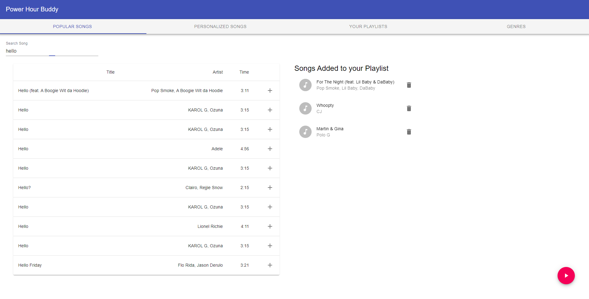
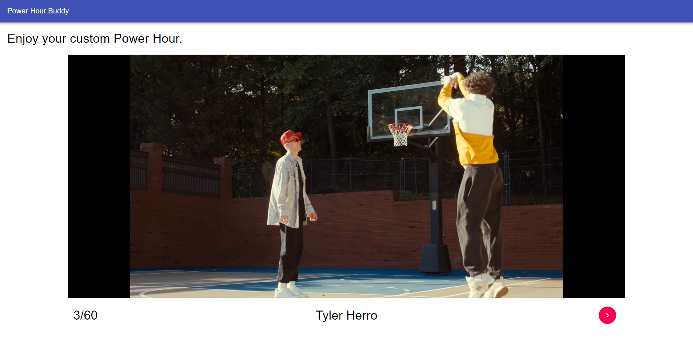
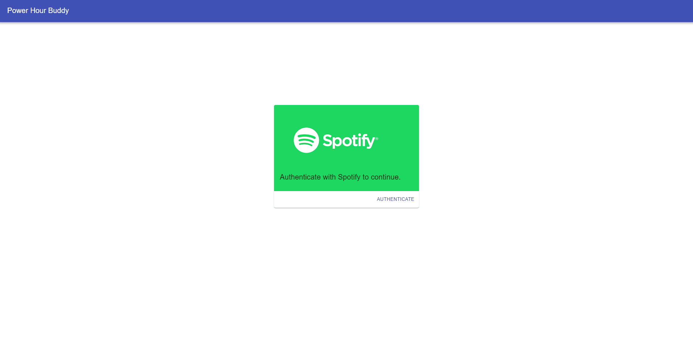
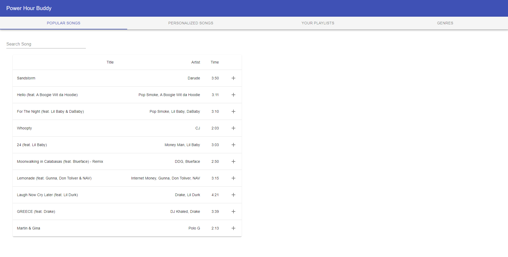
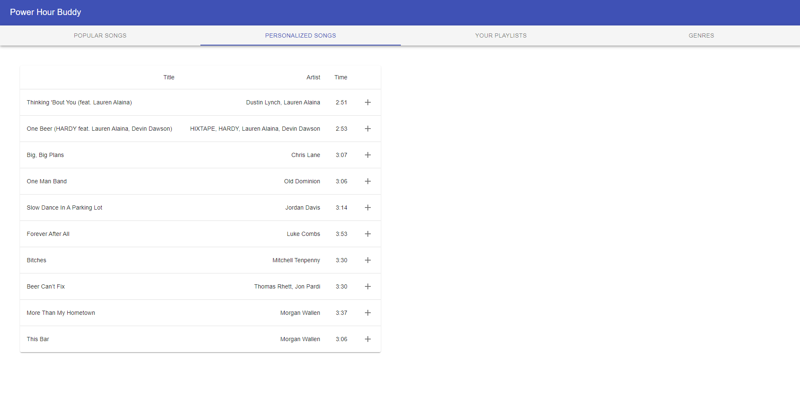
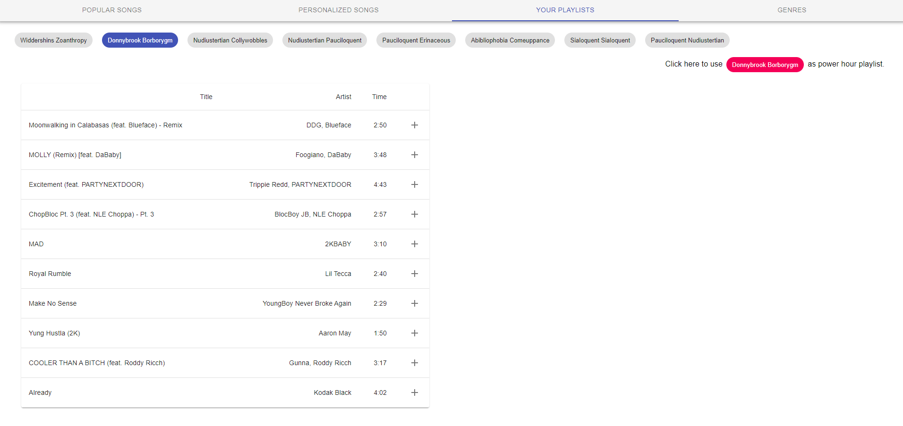
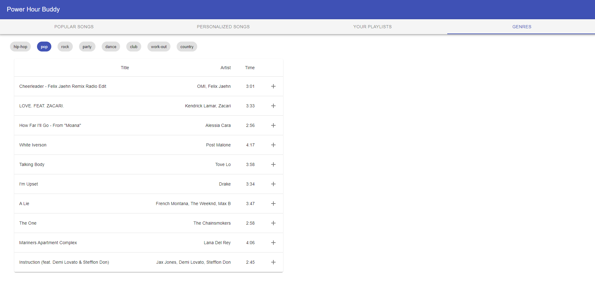

# Power Hour Buddy
## By Brian Arthur, Luca Trombetta, Anthony Reyes, Jarrett Roantree
## At QHacks 2021
Quickly construct a custom power hour video connecting to your Spotify account. Perfect to get any Friday or Saturday night started.

## Goal of this work
To build a playlist connected with Spotify and quickly produce a custom power hour video.

Power hour video is compilation of music videos played for one-minute, followed by everyone taking a shot of beer. 

## Libraries
We used the Spotify and Youtube APIs to create playlists and fecth Youtube URLs for the song music video.

We used [React](https://reactjs.org/) and [Material-UI](https://material-ui.com/) to build our responsive web app.

We used [Flask](https://flask.palletsprojects.com/en/1.1.x/) to host the web app and serve an API to generate Spotify playlists and fetch Youtube URLs.

## How to Use the App
Hosted with Heroku at [Power Hour Buddy](https://power-hour-buddy.herokuapp.com/)

Navigate to the website and authenticate your Spotify account.

Play Power Hour Video from
- Custom created playlist
- Existing personal Spotify playlist

Create a custom playlist with
- Featured songs
- Searching by song or artist
- Top personal songs from Spotify
- Existing personal Spotify playlists
- Top songs by genre

## Gallery

## Development Notes

This project was bootstrapped with [Create React App](https://github.com/facebook/create-react-app).

### `npm start`

Runs the app in the development mode.\
Open [http://localhost:3000](http://localhost:3000) to view it in the browser.

### `npm run build`

Builds the app for production to the `build` folder.\
It correctly bundles React in production mode and optimizes the build for the best performance.

### `python app.py`

Builds the Flask application. Hosts api to generate Spotify playlist, fetch Youtube URLs